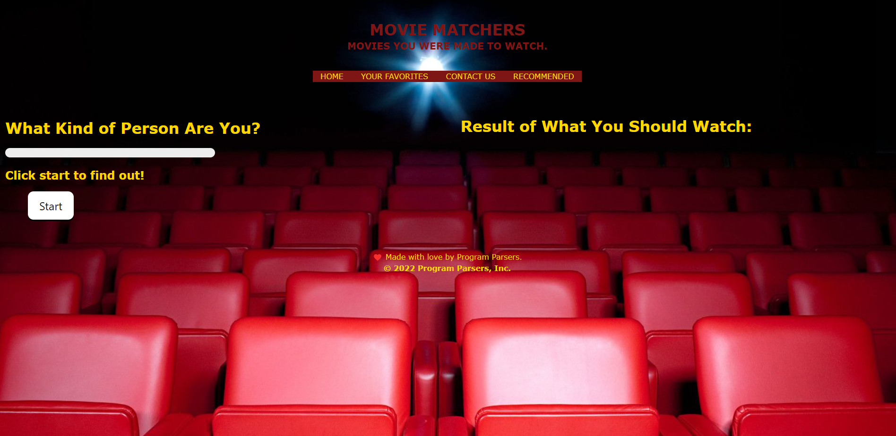

<p align="center">
    <h1 align="center">Movie Matchers</h1>
    <p align="center">Front-end website that pairs you with a movie and a beverage based off of a personality quiz! So sit back, relax, and just be yourself! We will do the rest!</p>
</p>

[](https://opensource.org/licenses/MIT)

## Table of Contents

<ol>
    <li><a href="#about-the-project">About</a></li>
    <li><a href="#languages-and-libraries-used">Languages & Libraries</a></li>
    <li><a href="#installation">Installation</a></li>
    <li><a href="#license">License</a></li>
    <li><a href="#authors">Authors</a></li>
</ol>

## About the Project

<br />
[Deployment](https://clairecashmore17.github.io/Movie-Matchers/)

## Languages and Libraries Used


## Installation

1. Clone the repo
   ```sh
   git clone https://github.com/clairecashmore17/Movie-Matchers.git
   ```
2. Open the project either locally or view on gh pages.

## License

Copyright 2022 Movie-Matchers

Permission is hereby granted, free of charge, to any person obtaining a copy of this software and associated documentation files (the "Software"), to deal in the Software without restriction, including without limitation the rights to use, copy, modify, merge, publish, distribute, sublicense, and/or sell copies of the Software, and to permit persons to whom the Software is furnished to do so, subject to the following conditions:

The above copyright notice and this permission notice shall be included in all copies or substantial portions of the Software.

THE SOFTWARE IS PROVIDED "AS IS", WITHOUT WARRANTY OF ANY KIND, EXPRESS OR IMPLIED, INCLUDING BUT NOT LIMITED TO THE WARRANTIES OF MERCHANTABILITY, FITNESS FOR A PARTICULAR PURPOSE AND NONINFRINGEMENT. IN NO EVENT SHALL THE AUTHORS OR COPYRIGHT HOLDERS BE LIABLE FOR ANY CLAIM, DAMAGES OR OTHER LIABILITY, WHETHER IN AN ACTION OF CONTRACT, TORT OR OTHERWISE, ARISING FROM, OUT OF OR IN CONNECTION WITH THE SOFTWARE OR THE USE OR OTHER DEALINGS IN THE SOFTWARE.

## Authors

Please feel free to reach out to us with any questions, recommendations, or other inquiries.

Claire Cashmore - [GitHub](https://github.com/claire_cashmore17/) - clairecashmore2017@gmail.com
Abate Bayih - [Github](https://github.com/Abateb)
Graham Smith - [Github](https://github.com/gsmith560/)
